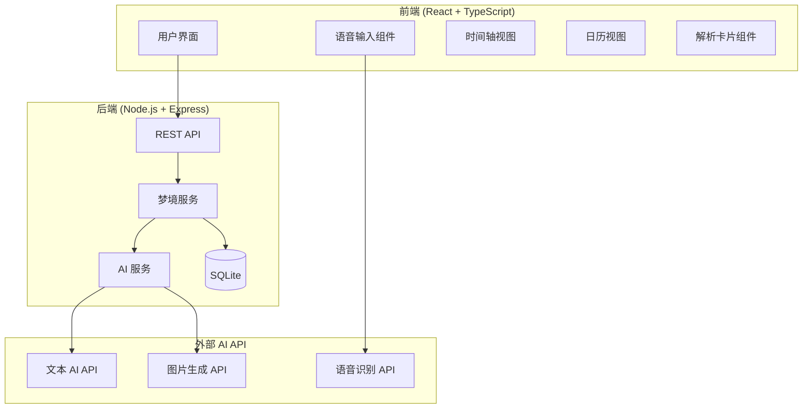

# Design Document: AI 梦境记录与解析器

## Overview

本设计文档描述 AI 梦境记录与解析器 MVP 的技术架构和实现方案。系统采用前后端分离架构，前端使用 React + TypeScript，后端使用 Node.js + Express + SQLite，集成国产 AI API（如智谱 AI/通义千问）进行梦境解析和图片生成。

## Architecture



### 技术栈选择

| 层级 | 技术 | 理由 |
|------|------|------|
| 前端框架 | React 18 + TypeScript | 组件化开发，类型安全 |
| 样式 | Tailwind CSS | 快速开发，响应式设计 |
| 后端框架 | Node.js + Express | 轻量级，快速开发 |
| 数据库 | SQLite | 零配置，适合 MVP |
| AI 文本 | 智谱 AI GLM-4 | 国产 AI，支持中文 |
| AI 图片 | 智谱 AI CogView | 国产图片生成 |
| 语音识别 | Web Speech API | 浏览器原生支持 |

## Components and Interfaces

### 前端组件

```typescript
// 梦境输入表单组件
interface DreamInputFormProps {
  onSubmit: (dream: CreateDreamDTO) => Promise<void>;
}

// 语音录制组件
interface VoiceRecorderProps {
  onTranscript: (text: string) => void;
  onError: (error: string) => void;
}

// 时间轴组件
interface TimelineProps {
  dreams: DreamEntry[];
  filters: DreamFilters;
  onDreamClick: (id: string) => void;
  onDreamHover: (id: string | null) => void;
}

// 日历组件
interface CalendarProps {
  dreams: DreamEntry[];
  currentMonth: Date;
  filters: DreamFilters;
  onDateClick: (date: Date) => void;
  onMonthChange: (month: Date) => void;
}

// 解析卡片组件
interface AnalysisCardProps {
  type: 'symbol' | 'emotion' | 'story';
  content: AnalysisResult;
}

// 筛选器
interface DreamFilters {
  dateRange?: { start: Date; end: Date };
  emotions?: EmotionTag[];
  clarityMin?: number;
  clarityMax?: number;
}
```

### 后端 API 接口

```typescript
// REST API 端点
// POST   /api/dreams          - 创建梦境记录
// GET    /api/dreams          - 获取梦境列表（支持分页和筛选）
// GET    /api/dreams/:id      - 获取单个梦境详情
// PUT    /api/dreams/:id      - 更新梦境记录
// DELETE /api/dreams/:id      - 删除梦境记录
// POST   /api/dreams/:id/analyze    - 触发 AI 解析
// POST   /api/dreams/:id/generate-image - 生成代表性图片

interface DreamAPI {
  createDream(dto: CreateDreamDTO): Promise<DreamEntry>;
  getDreams(params: QueryParams): Promise<PaginatedResult<DreamEntry>>;
  getDreamById(id: string): Promise<DreamEntry>;
  updateDream(id: string, dto: UpdateDreamDTO): Promise<DreamEntry>;
  deleteDream(id: string): Promise<void>;
  analyzeDream(id: string): Promise<AnalysisResult>;
  generateImage(id: string): Promise<string>;
}

interface QueryParams {
  page?: number;
  limit?: number;
  startDate?: string;
  endDate?: string;
  emotions?: string[];
  clarityMin?: number;
  clarityMax?: number;
}
```

### AI 服务接口

```typescript
interface AIService {
  // 象征意义解读
  analyzeSymbols(content: string): Promise<SymbolAnalysis>;
  
  // 情绪分析
  analyzeEmotions(content: string): Promise<EmotionAnalysis>;
  
  // 创意故事生成
  generateStory(content: string, format: 'story' | 'poem'): Promise<string>;
  
  // 图片生成
  generateImage(content: string): Promise<string>;
}

interface SymbolAnalysis {
  elements: Array<{
    name: string;
    type: 'person' | 'object' | 'scene' | 'action';
    meaning: string;
  }>;
}

interface EmotionAnalysis {
  primaryEmotion: string;
  emotionIntensity: number;
  potentialStress: string[];
  psychologicalInsight: string;
}
```

## Data Models

```typescript
// 情绪标签枚举
type EmotionTag = 'happy' | 'scary' | 'fantasy' | 'chaotic' | 'sad' | 'calm';

// 梦境记录实体
interface DreamEntry {
  id: string;
  content: string;
  dreamDate: Date;
  dreamTime?: string;
  emotionTag: EmotionTag;
  clarity: 1 | 2 | 3 | 4 | 5;
  isRecurring: boolean;
  createdAt: Date;
  updatedAt: Date;
  
  // 关联数据
  analysis?: DreamAnalysis;
  imageUrl?: string;
}

// 梦境解析结果
interface DreamAnalysis {
  id: string;
  dreamId: string;
  symbolAnalysis: SymbolAnalysis;
  emotionAnalysis: EmotionAnalysis;
  generatedStory?: string;
  generatedPoem?: string;
  createdAt: Date;
}

// 创建梦境 DTO
interface CreateDreamDTO {
  content: string;
  dreamDate: string;
  dreamTime?: string;
  emotionTag: EmotionTag;
  clarity: number;
  isRecurring: boolean;
}

// 更新梦境 DTO
interface UpdateDreamDTO {
  content?: string;
  dreamDate?: string;
  dreamTime?: string;
  emotionTag?: EmotionTag;
  clarity?: number;
  isRecurring?: boolean;
}
```

### 数据库 Schema (SQLite)

```sql
CREATE TABLE dreams (
  id TEXT PRIMARY KEY,
  content TEXT NOT NULL,
  dream_date DATE NOT NULL,
  dream_time TEXT,
  emotion_tag TEXT NOT NULL,
  clarity INTEGER NOT NULL CHECK (clarity >= 1 AND clarity <= 5),
  is_recurring BOOLEAN DEFAULT FALSE,
  image_url TEXT,
  created_at DATETIME DEFAULT CURRENT_TIMESTAMP,
  updated_at DATETIME DEFAULT CURRENT_TIMESTAMP
);

CREATE TABLE dream_analyses (
  id TEXT PRIMARY KEY,
  dream_id TEXT NOT NULL REFERENCES dreams(id) ON DELETE CASCADE,
  symbol_analysis TEXT NOT NULL,
  emotion_analysis TEXT NOT NULL,
  generated_story TEXT,
  generated_poem TEXT,
  created_at DATETIME DEFAULT CURRENT_TIMESTAMP
);

CREATE INDEX idx_dreams_date ON dreams(dream_date);
CREATE INDEX idx_dreams_emotion ON dreams(emotion_tag);
CREATE INDEX idx_dreams_clarity ON dreams(clarity);
```


## Correctness Properties

*A property is a characteristic or behavior that should hold true across all valid executions of a system—essentially, a formal statement about what the system should do. Properties serve as the bridge between human-readable specifications and machine-verifiable correctness guarantees.*

### Property 1: 梦境创建持久化

*For any* 有效的梦境内容（非空字符串）和元数据，创建梦境后，数据库中应存在该记录，且返回的 Dream_Entry 应包含所有提交的字段。

**Validates: Requirements 1.1, 10.3**

### Property 2: 空白内容验证

*For any* 空白字符串（空字符串、纯空格、纯制表符等），提交时应被拒绝，数据库中不应创建新记录。

**Validates: Requirements 1.6**

### Property 3: 清晰度范围约束

*For any* Dream_Entry，其 clarity 字段值必须在 1-5 范围内（包含边界）。

**Validates: Requirements 1.4**

### Property 4: 情绪标签枚举约束

*For any* Dream_Entry，其 emotionTag 字段值必须是预定义的六种情绪之一（happy/scary/fantasy/chaotic/sad/calm）。

**Validates: Requirements 1.3**

### Property 5: 解析结果结构完整性

*For any* 成功的梦境解析结果，应包含：象征分析（至少一个元素及其含义）、情绪分析（主要情绪和心理洞察）。

**Validates: Requirements 3.2, 3.3, 4.1, 4.2**

### Property 6: 创意生成非空

*For any* 有效的梦境内容，请求故事或诗歌生成后，返回的内容应为非空字符串。

**Validates: Requirements 5.1, 5.2**

### Property 7: 图片关联一致性

*For any* 成功生成图片的梦境，查询该梦境详情时，imageUrl 字段应为有效的 URL 字符串。

**Validates: Requirements 6.2**

### Property 8: 筛选结果正确性

*For any* 筛选条件（日期范围、情绪标签、清晰度范围），返回的所有梦境记录都应满足该筛选条件。

**Validates: Requirements 7.4, 7.5, 7.6, 8.6**

### Property 9: 日历标记一致性

*For any* 月份视图，有梦境记录的日期应被标记，无梦境记录的日期不应被标记。

**Validates: Requirements 8.2**

### Property 10: 分页结果完整性

*For any* 分页查询，返回的记录数不应超过请求的 limit，且 page 参数应正确偏移结果集。

**Validates: Requirements 10.4**

### Property 11: CRUD 操作一致性

*For any* 梦境记录，创建后可查询、更新后反映变更、删除后不可查询。

**Validates: Requirements 10.1**

## Error Handling

### 前端错误处理

| 错误场景 | 处理方式 |
|---------|---------|
| 空白内容提交 | 显示表单验证错误，阻止提交 |
| 语音识别失败 | 显示错误提示，提供重试按钮 |
| AI 解析超时 | 显示加载超时提示，提供重试选项 |
| 图片生成失败 | 显示占位图，提供重新生成按钮 |
| 网络请求失败 | 显示网络错误提示，自动重试或手动重试 |

### 后端错误处理

| 错误场景 | HTTP 状态码 | 响应格式 |
|---------|------------|---------|
| 参数验证失败 | 400 | `{ error: "validation_error", message: "..." }` |
| 资源不存在 | 404 | `{ error: "not_found", message: "..." }` |
| AI API 调用失败 | 502 | `{ error: "ai_service_error", message: "..." }` |
| 服务器内部错误 | 500 | `{ error: "internal_error", message: "..." }` |

### AI API 降级策略

```typescript
// AI 服务降级处理
async function analyzeWithFallback(content: string): Promise<AnalysisResult> {
  try {
    return await primaryAIService.analyze(content);
  } catch (error) {
    // 记录错误日志
    logger.error('Primary AI service failed', error);
    
    // 返回基础分析结果
    return {
      symbolAnalysis: { elements: [], fallback: true },
      emotionAnalysis: { 
        primaryEmotion: 'unknown',
        emotionIntensity: 0,
        potentialStress: [],
        psychologicalInsight: '暂时无法分析，请稍后重试'
      }
    };
  }
}
```

## Testing Strategy

### 测试框架选择

| 测试类型 | 框架 | 用途 |
|---------|------|------|
| 单元测试 | Jest | 函数和组件单元测试 |
| 属性测试 | fast-check | 属性基测试 |
| 组件测试 | React Testing Library | React 组件测试 |
| API 测试 | Supertest | Express API 测试 |
| E2E 测试 | Playwright (可选) | 端到端测试 |

### 单元测试覆盖

- 数据验证函数（内容非空、清晰度范围、情绪标签枚举）
- 筛选逻辑函数（日期范围、情绪、清晰度）
- 日期处理工具函数
- API 响应格式化函数

### 属性测试覆盖

每个属性测试配置：
- 最少 100 次迭代
- 使用 fast-check 生成随机测试数据
- 标注格式：`**Feature: dream-recorder, Property N: [property_text]**`

```typescript
// 示例：属性测试配置
import fc from 'fast-check';

// Feature: dream-recorder, Property 2: 空白内容验证
test('空白内容应被拒绝', () => {
  fc.assert(
    fc.property(
      fc.stringOf(fc.constantFrom(' ', '\t', '\n', '')),
      (blankContent) => {
        const result = validateDreamContent(blankContent);
        expect(result.valid).toBe(false);
      }
    ),
    { numRuns: 100 }
  );
});
```

### 测试数据生成器

```typescript
// 梦境数据生成器
const dreamEntryArbitrary = fc.record({
  content: fc.string({ minLength: 1 }),
  dreamDate: fc.date({ min: new Date('2020-01-01'), max: new Date() }),
  emotionTag: fc.constantFrom('happy', 'scary', 'fantasy', 'chaotic', 'sad', 'calm'),
  clarity: fc.integer({ min: 1, max: 5 }),
  isRecurring: fc.boolean()
});

// 筛选条件生成器
const filtersArbitrary = fc.record({
  dateRange: fc.option(fc.record({
    start: fc.date(),
    end: fc.date()
  })),
  emotions: fc.option(fc.array(fc.constantFrom('happy', 'scary', 'fantasy', 'chaotic', 'sad', 'calm'))),
  clarityMin: fc.option(fc.integer({ min: 1, max: 5 })),
  clarityMax: fc.option(fc.integer({ min: 1, max: 5 }))
});
```
