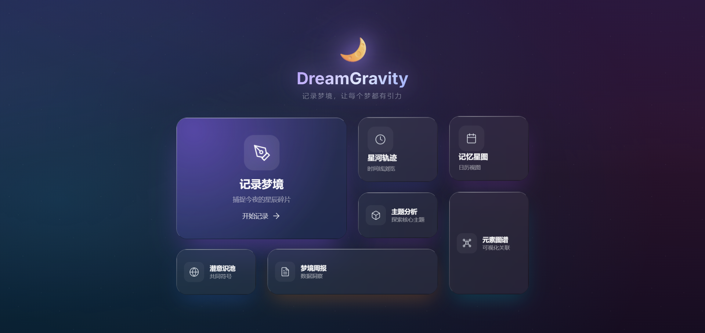
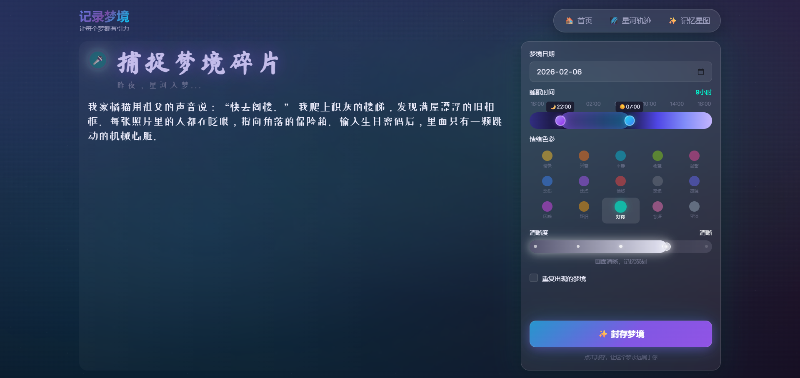
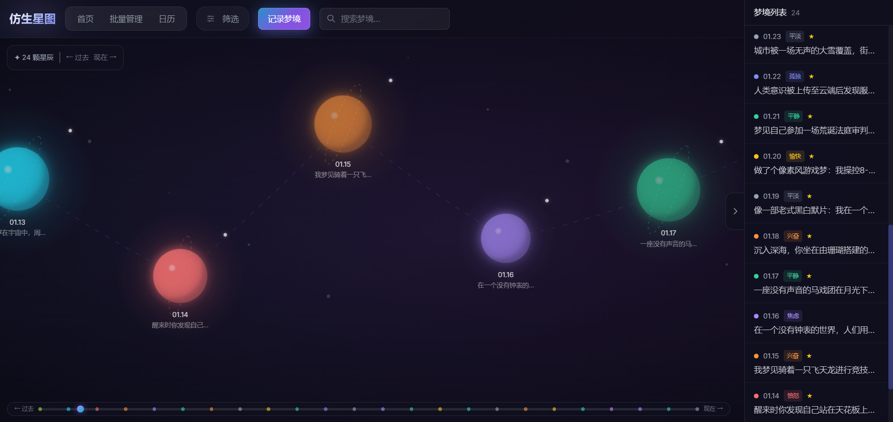
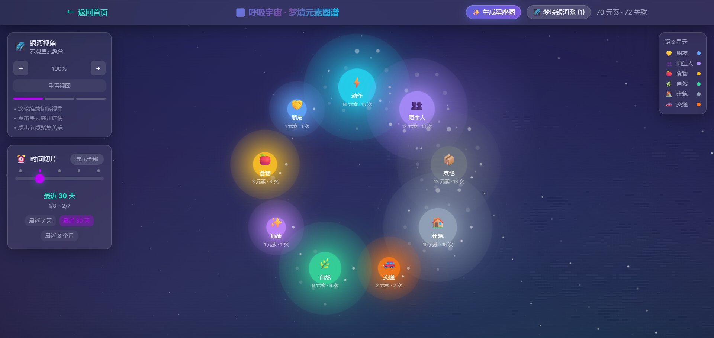
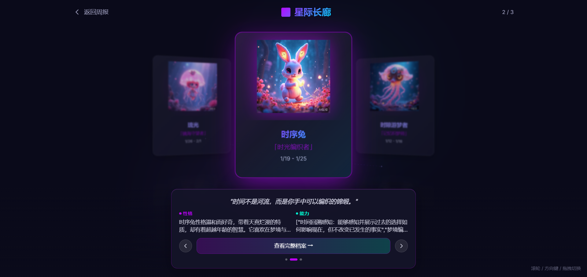
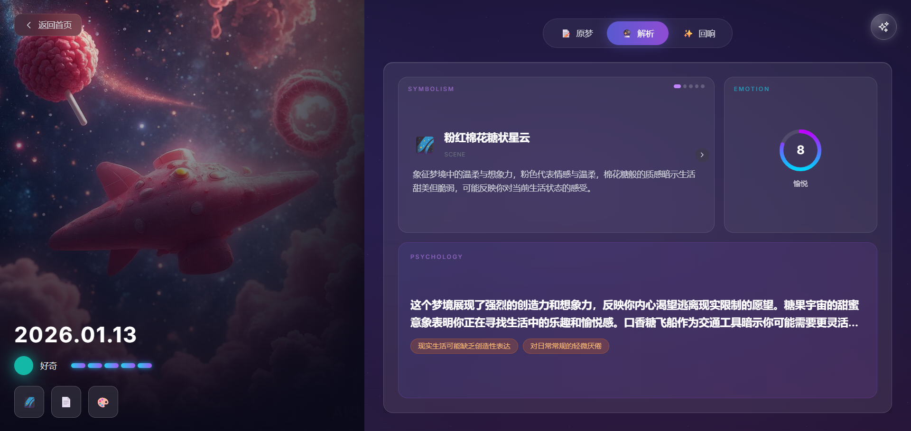

# DreamGravity 梦有引力 🌙

> 记录梦境，解析潜意识，构建你的专属梦境宇宙

DreamGravity 是一款基于 AI 的梦境记录与分析应用，帮助你捕捉每一个梦境片段，深入解析梦境背后的象征意义，并将你的梦境世界可视化呈现。

<p align="center">
  
  
</p>
<p align="center">
  
  
</p>
<p align="center">
  
  
</p>

## ✨ 核心功能

| 功能模块 | 描述 |
|---------|------|
| 📝 梦境记录 | 文字/语音输入，情绪标签，清晰度评分，重复梦境追踪 |
| 🔮 AI 智能解析 | 象征意义分析，模式识别（压力源/重复主题/预示性），心理洞察 |
| 🎨 创意生成 | 梦境可视化图片，短篇故事/诗歌改编，专属 IP 角色 |
| 📊 数据可视化 | 时间轴/日历视图，元素图谱，梦境星座卡片，统计报告 |
| 📅 周报系统 | 每周梦境总结，周度 IP 角色和图腾，趋势追踪 |
| 🌐 集体潜意识池 | 匿名分享，浏览他人梦境，融合"梦境宇宙"故事 |
| 📤 导出功能 | 梦境详情 PDF，统计报告，星座卡片 |

## 🛠️ 技术栈

| 层级 | 技术 |
|------|------|
| 前端 | React 18 + TypeScript + Vite + Tailwind CSS |
| 后端 | Node.js + Express + TypeScript |
| 数据库 | SQLite (better-sqlite3) |
| AI 服务 | 智谱 AI (GLM-4 / CogView-3) |
| 可视化 | D3.js + Recharts + Three.js |

## 🔧 项目结构

```
dream-gravity/
├── frontend/                # React 前端应用
│   └── src/
│       ├── components/      # UI 组件
│       │   ├── AnalysisCards/       # 分析卡片
│       │   ├── BreathingUniverse/   # 呼吸宇宙动效
│       │   ├── Calendar/            # 日历组件
│       │   ├── ConstellationMap/    # 星座图谱
│       │   ├── DreamFollowup/       # 梦境后续关联
│       │   ├── DreamInputForm/      # 梦境输入表单
│       │   ├── DreamPattern/        # 梦境模式
│       │   ├── ExportPdf/           # PDF 导出
│       │   ├── SubconsciousEcho/    # 潜意识回响
│       │   ├── Timeline/            # 时间轴
│       │   └── VoiceRecorder/       # 语音录入
│       ├── pages/           # 页面组件
│       └── utils/           # 工具函数
├── backend/                 # Express 后端服务
│   └── src/
│       ├── dao/             # 数据访问层
│       ├── database/        # 数据库配置
│       ├── middleware/      # 中间件
│       ├── routes/          # API 路由
│       └── services/        # 业务服务
│           └── ai/          # AI 服务封装
└── shared/                  # 共享类型定义
    └── types/
```

## 🚀 快速开始

### 环境要求

- Node.js >= 18
- npm >= 9

### 安装与配置

```bash
# 克隆项目
git clone <repository-url>
cd dream-gravity

# 一键安装所有依赖
npm run install:all

# 配置环境变量
cd backend
copy .env.example .env
# 编辑 .env 文件，填入智谱 AI API Key
```

> 💡 获取 API Key：访问 [智谱 AI 开放平台](https://open.bigmodel.cn/)

### 启动

```bash
# 在根目录一键启动前后端
npm run dev
```

访问 http://localhost:5173 开始使用。

## 📡 API 端点

### 梦境管理
| 方法 | 端点 | 描述 |
|------|------|------|
| GET | /api/dreams | 获取梦境列表（支持分页和筛选） |
| POST | /api/dreams | 创建新梦境 |
| GET | /api/dreams/:id | 获取梦境详情 |
| PUT | /api/dreams/:id | 更新梦境 |
| DELETE | /api/dreams/:id | 删除梦境 |
| POST | /api/dreams/batch-delete | 批量删除梦境 |

### AI 分析
| 方法 | 端点 | 描述 |
|------|------|------|
| POST | /api/dreams/:id/analyze | AI 解析梦境 |
| POST | /api/dreams/:id/generate-image | 生成梦境图片 |
| POST | /api/dreams/:id/generate-creative | 生成创意内容（故事/诗歌） |

### 梦境模式
| 方法 | 端点 | 描述 |
|------|------|------|
| POST | /api/dreams/:id/patterns | 分析梦境模式 |
| GET | /api/patterns/summary | 获取模式统计摘要 |

### 后续关联
| 方法 | 端点 | 描述 |
|------|------|------|
| POST | /api/dreams/:id/followups | 添加后续关联 |
| GET | /api/dreams/:id/followups | 获取梦境的后续关联 |

### 统计与报告
| 方法 | 端点 | 描述 |
|------|------|------|
| GET | /api/statistics | 获取梦境统计数据 |
| POST | /api/statistics/report | 生成 AI 分析报告 |
| GET | /api/statistics/reports | 获取历史报告列表 |

### 元素图谱
| 方法 | 端点 | 描述 |
|------|------|------|
| GET | /api/element-graph | 获取梦境元素图谱 |
| POST | /api/element-graph/constellation | 生成星座卡片 |
| GET | /api/element-graph/constellations | 获取星座卡片列表 |

### 周报
| 方法 | 端点 | 描述 |
|------|------|------|
| GET | /api/weekly-reports/weeks | 获取所有周列表 |
| POST | /api/weekly-reports | 生成周报 |
| GET | /api/weekly-reports/:id | 获取周报详情 |
| POST | /api/weekly-reports/:id/generate-ip | 生成 IP 角色图片 |

### 集体潜意识池
| 方法 | 端点 | 描述 |
|------|------|------|
| POST | /api/collective/share | 分享梦境到公共池 |
| GET | /api/collective/dreams | 获取公共池梦境列表 |
| POST | /api/collective/universe-story | 生成梦境宇宙故事 |

### 导出
| 方法 | 端点 | 描述 |
|------|------|------|
| POST | /api/exports/dream-pdf | 导出梦境详情 PDF |
| POST | /api/exports/report-pdf | 导出统计报告 PDF |

## 🏗️ 构建与部署

```bash
# 构建全部
npm run build

# 单独构建
npm run build:frontend
npm run build:backend
```

### 部署建议

| 服务 | 推荐平台 | 配置要点 |
|------|---------|---------|
| 前端 | Vercel | 根目录设为 `frontend`，配置 `VITE_API_URL` |
| 后端 | Railway / Render | 根目录设为 `backend`，配置 `ZHIPU_API_KEY` 和 `FRONTEND_URL` |

## 📄 许可证

MIT License
